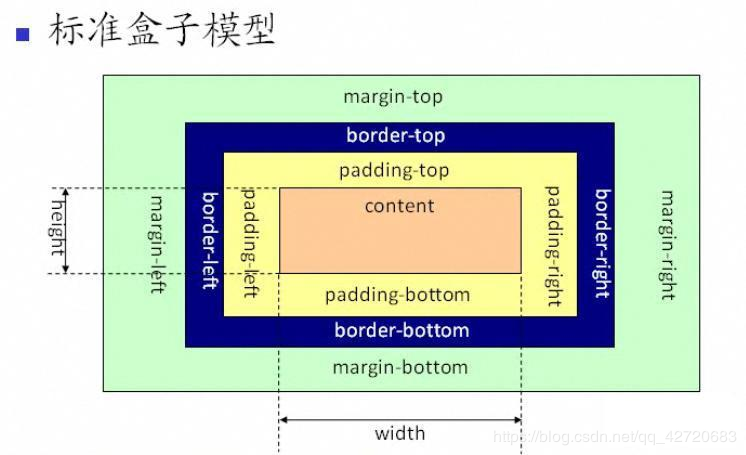

## 盒模型

- 标准盒模型（content-box），又称内容盒子，盒子的总宽度 = margin + border +padding + width；元素的 width，**实际上只包含 content **（可以理解为现实生活中的气球，大小可以随内容的变化而变化。）
  

- IE 盒模型（border-box），盒子的总宽度 = margin + width；**元素的 wdith，实际上包含了 content + padding + border**
  
- box-sizing：属性允许您以特定的方式定义匹配某个区域的特定元素：

```
//标准模型
box-sizing:content-box;
//IE模型
box-sizing:border-box;
```

- margin、border、padding、content 由外到里

- 几种获得宽高的方式

  - **document.style.width/document.style.height**: 这种方式只能取到 dom 元素内联样式所设置的宽度，也就是说如果该节点的样式是在 style 标签中或外联的 CSS 文件中设置的话，通过这种方法是获取不到 dom 的宽和高
  - document.currentStyle.width/document.currentStyle.height: 这种方式获取的是在页面渲染完成后的结果，就是说不管是哪种方式设置的样式都能获取到。但这种方式只有 IE 支持
  - window.getComputedStyle(dom).width/window.getComputedStyle(dom).height:这种方式的原型和 2 是一样的，这个可以兼容更多的浏览器，通用性更好一点
  - document.getBoundingClientRect(dom).width/document.getBoundingClientRect().height：这种方式是根据元素在视窗中的绝对位置来获取宽度的
  - **document.offsetWidth/document.offsetHeight**：最常用的，兼容最好的

- 各种获得宽高的方式

  - 获取屏幕的高度和宽度（屏幕分辨率）：**window.screen.height/window.screen.width**
  - 获取屏幕工作区域的高度和宽度（去掉状态栏）：window.screen.availHeight/window.screen.availWidth
  - 网页全文的高度和宽度：**document.body.scrollHeight/document.body.scrollWidth**
  - 滚动条卷上去的高度和向右卷的宽度：\*document.body.scrollTop/document.body.scrollLeft\*\*
  - 网页可见区域的高度和宽度（不加边线）：**document.body.clientHeight/document.body.clientWidth**
  - 网页可见区域的高度和宽度（加边线）：**document.body.offsetHeight/document.body.offsetWidth**

- 边距重叠解决方案（BFC）BFC 原理
  - 内部的 box 会在垂直方向，一个接一个的放置，每个元素的 margin box 的左边，与包含块 border box 的左边相接触
  - 垂直方向的距离由 margin 决定，属于一个 BFC 的两个相邻 box 的 margin 会发生重叠
  - BFC 的区域不会与浮动区域的 box 重叠
  - BFC 是一个页面上的独立的容器，外面的元素不会影响 BFC 里的元素，反过来，里面的也不会影响外面的
  - 计算 BFC 高度的时候，浮动元素也会参与计算创建 BFC
  - float 属性不为 none(脱离文档流)
  - position 为 absoulte 或 fixed
  - display 为 inline-block、table-cell、table-caption、flex、inline-flex
  - overflow 不为 visible
  - 根元素
