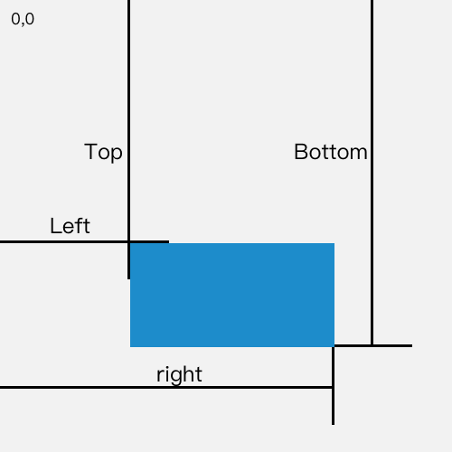

## getBoundingClientRect

- 该方法返回一个矩形对象，其中四个属性：left、top、right、bottom，分别表示元素各边与页面的上边和左边的距离，x、y 表示左上角定点的坐标位置

- 通过这个方法计算得出的 left、top、right、bottom、x、y 会随着视口区域内滚动操作而发生变化，如果你需要获得相对于整个网页左上角定位的属性值，那么只要 top、left 属性值加上当前滚动位置

为了跨浏览器兼容，请使用 window.pageXOffset 和 window.pageYOffset 代替 window.scrollX 和 window.scrollY
