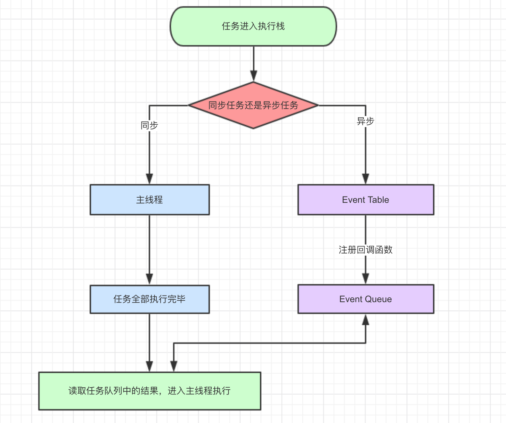

## 事件循环

- javascript中的任务分为两类：同步任务、异步任务

- 网页的渲染过程，比如页面骨架和页面元素的渲染是一堆同步的任务；而像加载图片、视频、音频之类占用资源大，耗时久的任务就是异步任务
;
- 导图要表达的内容用文字来表述的话：
  - 同步和异步任务分别进入不同的“场所”，同步的进入主线程，异步的进入Event Table并注册函数
  - 当指定的事情完成后，Event Table会将这个函数移入到Event Queue。
  - 主线程内的任务执行完毕为空，会去Event Queue读取相应的函数，进入主线程执行
  - 上述的过程会不断的重复，也就是常说的事件循环Event Loop

- javascript引擎中存在monitoring process（监控）进程，会持续不断检查主线程执行栈是否为空，一旦为空，就会去Event Queue那里检查是否有等待被调用的函数
```
let data = [];
$.ajax({
  url:"www.baidu.com",
  data:data,
  success:()=>{
    console.log("发送成功");
  }
});
console.log("代码执行结束");
//1、ajax首先进入Event Loop，注册回调函数success
//2、执行console.log("代码执行结束")；
//3、ajax事件执行完成，回调函数success进入到Event Queue
//4、主线程从Event Queue读取回调函数success并执行
```

- 除了广义的同步和异步任务，对任务还可以进行更精细的定义：
  - macro-task（宏任务）：包括整体的script，setTimeout，setInterval
  - micro-task（微任务）：Promise,process.nextTick

- 不同的任务会进行不同的Event queue，比如setTimeout，setInterval会进行相同的Event queue

- 事件循环的顺序，决定了js代码的执行顺序。进入整体代码（宏任务）后，开始第一次循环。接着执行所有微任务。再从宏任务开始，找到其中一个任务队列执行完毕，再执行所有微任务

```
setTimeout(function(){
  console.log("setTimeout");
});

new Promise(function(resvole){
  console.log("promise");
}).then(function(){
  console.log("then");
})

console.log("console.");
/* 
1、这段代码首先进入宏任务，进入主线程
2、先遇到setTimout,将其回调函数注册后发布到宏任务Event Queue(注册过程与之前相同)
3、接下来遇到Promise，new Promise立即执行，then函数分发到微任务Event Queue
4、遇到console.log(),立即执行
5、整体代码script作为第一个宏任务执行结束，看看有哪些微任务？我们发现了then在微任务Event Queue里面
6、第一轮带伤循环结束了，开始第二轮循环，当然要从宏任务的Event Queue开始，
  发现宏任务Event Queue中的setTimeout对应的回调函数，立即执行
*/
```
