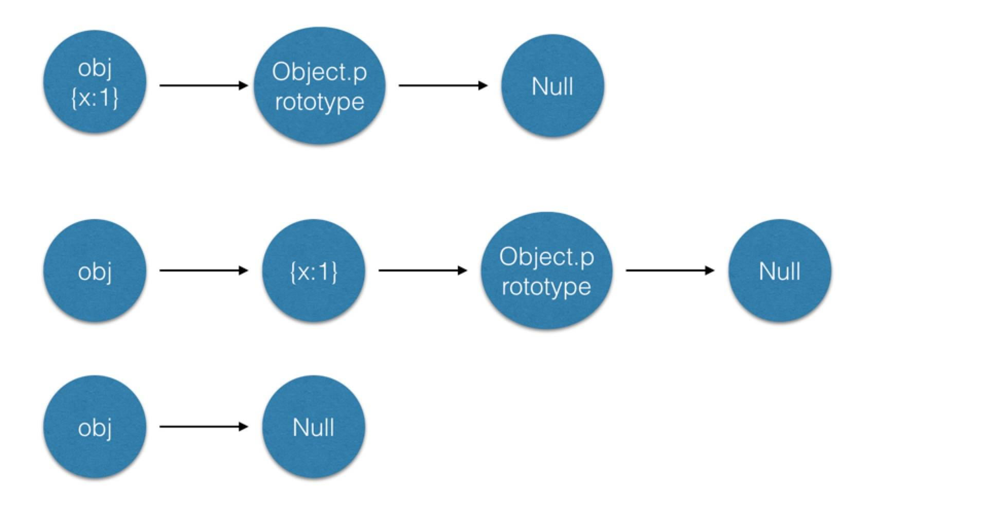

## 创建对象

- 一般创建对象有以下四种写法：

  - 对象字面量
  - 使用构造函数
  - Object.create
  - Object.create(null)

```
//第一种-对象字面量
let obj = {a:1};
obj.a;//1
typeof obj.toString //"function"

//第二种-使用构造函数
function Person(name){//通过创建一个构造函数来定义对象的类型
  this.name = name;
}
var p1 = new Person("tom");//通过new创建对象实例

//第三种-Object.create
let obj2 = Object.create({a:1});
obj2.a; //1
typeof obj2.toString //"function"

//第四种-Object.create(null)
let obj3 = Object.create(null);
typeof obj3.toString; //undefined
```



- Object.create 可以理解为继承一个对象，它是一个 ES5 的新特性，对于旧版浏览器需要做兼容，基本代码如下

```
if(!Object.create){
  Object.create = function(o){
    function F(){}; //定义一个隐式的构造函数
    F.prototype = o;
    return new F(); //其实还是通过new来实现的
  }
}
```
