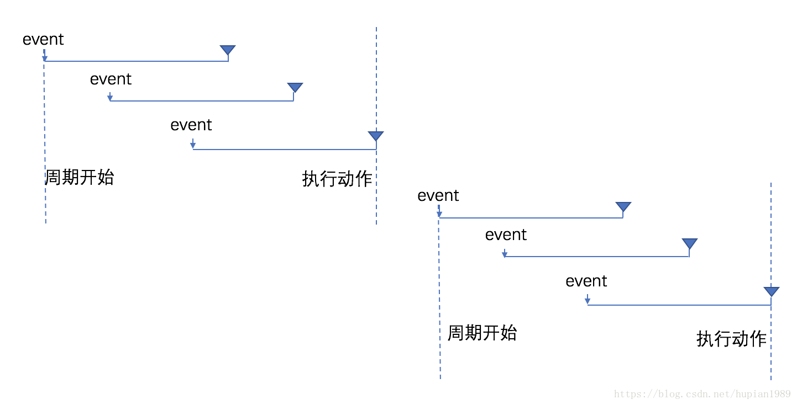
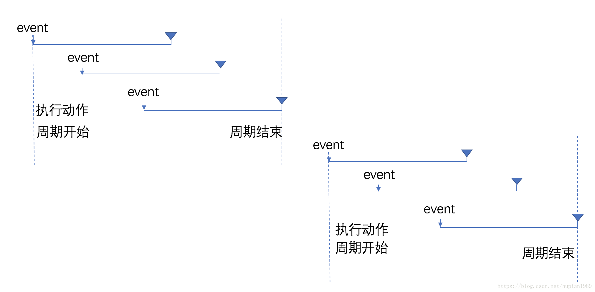
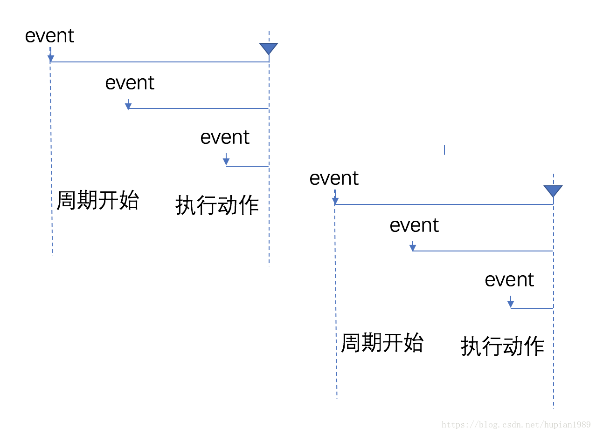
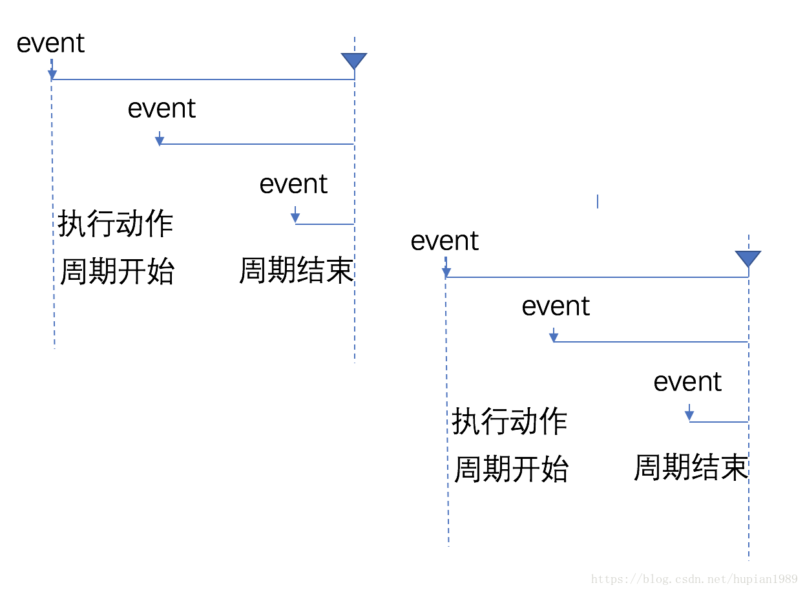

## 防抖(debounce) 和 节流(throttling)

- **防抖和节流是针对响应跟不上触发频率这类问题的两种解决方案**。在给 DOM 绑定事件时，有些事件是无法控制触发频率的。如**鼠标移动事件 onmousemove,滚动滚动条事件 onscroll,窗口大小改变事件 onresize**，瞬间的操作都会导致这些事件会被高频触发。如果事件的回调较为复杂，就会导致响应跟不上触发，出现页面卡顿，假死现象。在实时输入时，如果我们绑定 onkeyup 事件发请求去服务端检查，用户输入过程中，事件的触发频率也会很高，会导致大量的请求发出，响应速度会大大跟不上触发。

- 针对此类快速连续触发和不可控的高频触发问题，debounce 和 throttling 给出了两种解决策略

### debounce，

- 原理：尽管触发事件，但是我一定在事件触发 n 秒后才执行，如果你在一个事件触发的 n 秒内又触发了这个事件，那我就以新的时间为准，n 秒后才执行，总之，就是要等你触发完事件 n 秒内不再触发事件，我才执行。

- 防抖（debounce）:将多次高频操作优化为只在最后一次执行，通常使用的场景是：用户输入，只需要在用户输入完成后做最后一次检验即可

- **策略是当事件被触发时，设定一个周期延迟执行动作，若期间又被触发，则重新设定周期，直到周期结束，执行动作**。这是 debounce 的基本思想，在后期又扩展了**前缘 debounce，即执行动作在前，然后设定周期，周期内有事件被触发，不执行动作，而周期重新设定**

- **debounce 的特点是当事件快速连续不断触发时，动作只会执行一次。延迟 debounce，是在周期结束时执行，前缘 debounce，是在周期开始时执行。但当触发有间断，且间断大于我们设定的时间间隔时，动作就会有多次执行。**

- 通过函数防抖，解决了多次触发事件时的性能问题

- 延迟防抖
  

- 前缘防抖
  

```
<div>111</div>
<div>222</div>
<div>333</div>
<div>444</div>
<div>555</div>
<div>666</div>
<div>777</div>
<script>
  function debounce_2(method, delay) {
    let timer = null;
    return function () {
      let selt = this;
      args = arguments;
      timer && clearTimeout(timer);
      timer = setTimeout(function () {
        method.apply(self, args);
      }, delay);
    }
  }

  window.onscroll = debounce_2(function () {
    let scrollTop = document.body.scrollTop || document.documentElement.scrollTop;
    console.log("滚动条位置：" + scrollTop);
  }, 1000)
</script>
```

### 节流 throttling

- 定义：触发函数事件后，短时间间隔内无法连续调用，只有上一次函数执行后，过了规定的时间间隔，才能进行下一次的函数

- 节流（throttle）:每隔一段时间后执行一次，也就是降低频率，将高频操作优化为低频操作，通常使用场景：滚动事件或resize事件，通常每隔100~500ms执行一次即可

- 原理：对处理函数进行延时操作，若设定的延时到来之前，再次触发事件，则清除上一次的延时操作定时器，重新定时

- 原理：如果你持续触发事件，每隔一段时间，只执行一次事件

- 节流的策略是，固定周期内，只执行一次动作，若有新事件触发，不执行。周期结束后，又有事件触发，开始新的周期

- 节流策略也分前缘和延迟两种。与 debounce 类似，延迟是指周期结束后执行动作，前缘是指执行动作后再开始周期

- trrottling 的特点在连续高频触发事件时，动作会被定期执行，响应平滑

- 关于节流的实现，有两种主流的实现方式，一种是时间戳，一种是设置定时器

  - 时间戳，当触发事件的时候，我们取出当前时间戳，然后减去之前的时间戳（最一开始值设为0），如果大于设置的时间周期，就执行函数，然后更新时间戳为当前的的时间戳，如果小于，就不执行。
  - 定时器，当触发事件的时候，我们设置一个定时器，在触发事件的时候，如果定时器存在，就不执行，直到定时器执行，然后执行函数，清空定时器，这样就可以设置下个定时器

- 延迟节流
  

- 前缘节流
  

```
function throllte(fn,wait){
  let timeout = null;

  return function(){
    let context = this;
    let args = arguments;

    if(!timeout){
      timeout = setTimeout(()=>{
        fn.apply(context,args);
        /* 
        每次定时器执行**后**将定时器置入空，
        以保证至少wait时间过后定时器可以再次执行 
        */
        timeout = null; 
      },wait)
    }
  }
}
```

```
  // 时间戳 
  var count = 1;
  var container = document.getElementById('container');

  function getUserAction(e) {
    console.log(this);
    console.log(e);
    container.innerHTML = count++;
  };

  function throttle(func, wait) {
    var context, args;
    var pervious = 0;
    return function () {
      var now = +new Date();
      context = this;
      args = arguments;
      if (now - pervious > wait) {
        func.apply(context, args);
        pervious = now;
      }
    }
  }

  container.onmousemove = throttle(getUserAction, 1000);
```
```
// 定时器
var count = 1;
var container = document.getElementById('container');

function getUserAction(e) {
  console.log(this);
  console.log(e);
  container.innerHTML = count++;
};


function throttle(func,wait){
  var timeout;
  var pervious = 0;

  return function(){
    context = this;
    args = arguments;
    if(!timeout){
      timeout = setTimeout(() => {
        timeout = null;
        func.apply(context,args);
      }, wait);
    }
  }
}

container.onmousemove = throttle(getUserAction, 1000);
```
```
//时间戳+定时器
function throttle(method, mustRunDelay) {
  let timer, args = arguments,
    start;
  return function loop() {
    let selt = this;
    let now = Date.now();
    if (!start) {
      start = now;
    }
    if (timer) {
      clearTimeout(timer);
    }
    if (now - start >= mustRunDelay) {
      method.apply(self, args);
      start = now;
    } else {
      timer = setTimeout(function () {
        loop.apply(self, args);
      }, 50);
    }
  }
}

window.onscroll = throttle(function () {
  let scrollTop = document.body.scrollTop || document.documentElement.scrollTop;
  console.log("滚动条位置：" + scrollTop);
}, 800)
```
