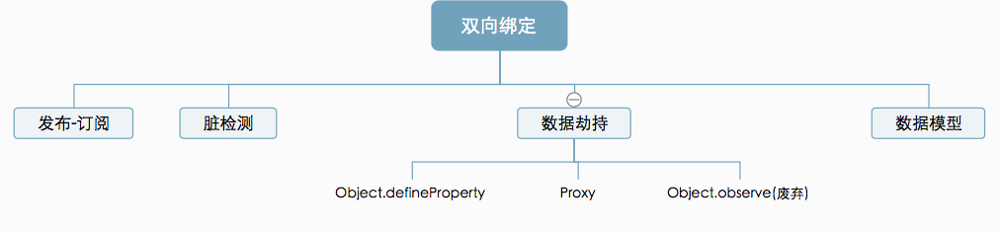

## vue

- Vue 三要素

  - 响应式：例如如何监听数据变化，其中的实现方法就是双向数据绑定
  - 模板引擎：如何解析模板
  - 渲染：Vue 如何监听到的数据变化和解析后的 HTML 进行渲染

- 数据驱动 DOM 是 vue.js 的核心理念，所以不到万不得已不要主动操作 DOM，只需要维护好数据，DOM 的事 Vue 会优雅的处理

- 可以实现双向绑定的方法有很多，KnockoutJS 基于观察者模式的双向绑定，Ember 基于数据模型的双向绑定，Angular 基于脏检查的双向绑定
  
- 常见的基于数据劫持的双向绑定有两种实现，一个是 Vue3.x 之前使用的 Object.defineProperty，另一个是 ES2015 中新增的 Proxy，而 Vue3.x 版本后加入 Proxy 从而代替 Object.defineProtperty

- 严格来讲 Proxy 应该被称为“代理”而非“劫持”
