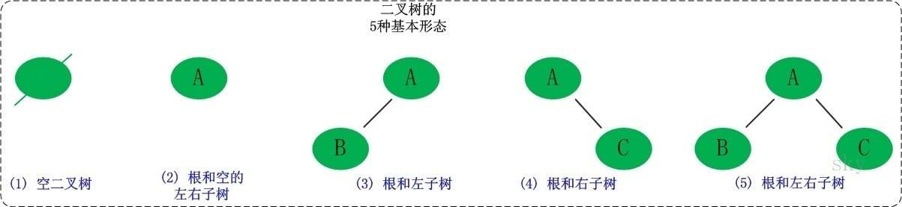

## 二叉树

- 树是用来模拟具有树状结构性质的数据集合。根据它的特性可以分为非常多的种类，对于我们来讲，掌握二叉树这种结构就足够了，它也是树最简单、应用最广泛的种类。

- 二叉树是一种典型的树状结构。如它的名字所描述的那样，二叉树是每个节点最多有两个子树的树结构，通常子树被称作“左子树”和“右子树”

  - 根节点：二叉树最顶层的节点
  - 分支节点：除了根节点以外且拥有叶子节点
  - 叶子节点：除了自身，没有其他子节点

- 二叉树和链表比较相似，都是操作指针（链表是指向下一个元素，二叉树是指向左右子节点）

### 二叉搜索树（排序二叉树）

- 二叉搜索树是特殊的二叉树，考察二叉搜索树的题目一般都是考察二叉搜索树的特性

- 二叉搜索树主要用来做一些搜索，还有就是排序，另外就是，二叉搜索树里查找最大值和最小值很方便。

- 若任意节点的左子树不空，则左子树上所有节点的值均小于它的根节点的值；
- 若任意节点的右子树不空，则右子树上所有节点的值均大于它的根节点的值；
- 任意节点的左、右子树也需要满足左边小右边大的性质

### 二叉树的插入

  - 1、插入根节点
  - 2、跟根节点做比较，比根节点大，当前节点是往右子树插入；比根节点小，当前节点是往左子树插入
  - 3、插入之前要先查看是否已经包含子节点，若已包含递归比较

### 二叉树的遍历

  **重点中的重点，最好同时掌握递归和非递归版本，递归版本很容易书写，但是真正考察基本功的是非递归版本**

  - 二叉树的中序遍历：先遍历左节点，再遍历自己，最后遍历右节点，输出的刚好是有序的列表（最常用的）

  - 二叉树的前序遍历：先自己，再遍历左节点，最后遍历右节点（当需要复制一份二叉树的时候使用前序遍历的效果是最好的，复制二叉树要比重新构造二叉树的效率高得多【高10倍左右】）

  - 二叉树的后序遍历：先左节点，再右节点，最后自己（可以应用于操作系统的文件系统之中，遍历一个目录先会遍历子目录中的文件再遍历原目录中的文件）

  **最常用的一般是中序遍历，因为中序遍历可以得到一个已经排好序的列表，这也是为什么会用二叉搜索树排序的原因**

### 二叉树的查找
  - 二叉树的查找分为三种：

    - 查找二叉树节点的最小值
    - 查找二叉树节点的最大值
    - 根据给定数值查找在二叉树中是否存在（相同）

  - 查找其实和插入差不多，都是去比较左右节点的大小，然后往下找

    - 如果root = null, 则二叉树中没有任何节点，直接return，或者报个错什么的。
    - 循环查找