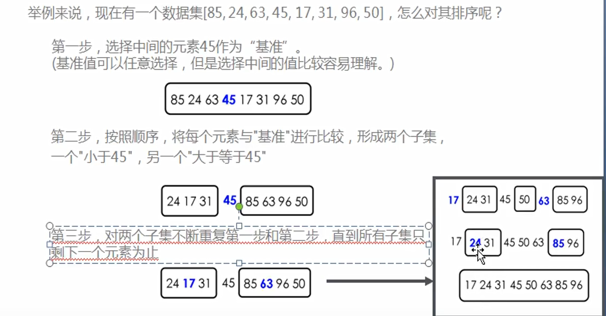

## 快排

- 目前来说所有排序算法中效率最高的最快的一种排序方式
- 快速排序相当于冒泡排序的一个升级版
  - 冒泡排序需要很多次交换，才能在一次循环中，将最大值放在正确的位置
  - 而快速排序可以在一次循环中（其实是递归调用），找出某个元素的正确位置，并且该元素之后不再需要任何移动

- 快速排序的思想是**分而治之**
  - 在数据集中，选择一个元素作为基准（pivot）
  - 所有小于“基准”的元素，都移到“基准”的左边；所有大于“基准”的元素，都移到“基准”的右边
  - 对“基准”左边右边的两个子集，不断重复第一步和第二步，直接到所有子集只剩下元素为止
  

```
let arr = [23,129,2,334,26,24,12,66,34,32,99,50];

function quickSort(arr){
  //退出递归的临界值设置，防止死循环，内存溢出
  if(arr.length<=0){
    return arr;
  }
  //1、取出基准值(以数组中间的值做为基准值)
  let midIndex = Math.floor(arr.length/2);//数组长度除以2可能是小数，所以要进行取整
  let midValue = arr.splice(midIndex,1); //将基准值从数组中**取出**(从数组中取出来，不在对基准值进行操作；如果不使用splice使用arr[midIndex]那么基准中还存在在数组中造成错误)
  //2、比大小，分左右(比临界值小的数据放在left中，大的放在right中)
  let left = [];
  let right = [];

  for(let i=0;i<arr.length;i++){
    if(midValue>arr[i]){
      left.push(arr[i]);
      right.push(arr[i]);
    }
  }
  //3、重复第一步第二步(递归调用)
  return quickSort(left).concat(midValue,quickSort(right));
}
let res = quickSort(arr);
console.log(res);
```

- 快速排序中有一个重要的步骤就是**选择枢纽**
  - 一种方案是只接选择第一个元素作为枢纽（但第一个元素作为枢纽在某些情况下，效率并不是特别高）
  - 另一种方案是使用随机数（但随机数函数本身就是一个耗性能的操作）
  - 另一种比较优秀的方案：取头、中、尾的中位数（例如8，12，3）中的中位数就是8；【left=0;right=arr.length-1;center=(left+right)/2; 在arr这三个下标位置元素中找到中位数】；在找枢纽的时候会将left,right,center三个值进行排序以找到中位数，找到后将最大的数字放到数组中最后的位置，而中位数放到倒数第二位