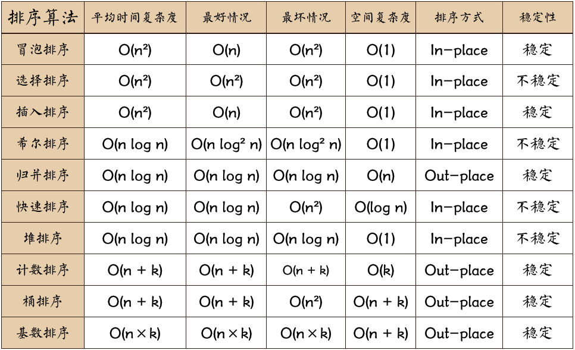

## 算法 algorithm 

- 算法是解决特定问题求解步骤的描述，在计算机中表现为指令的有序系列，并且每条指令表示一个或多个操作

- 算法具有五个基本特性：输入、输出、有穷性、确定性和可行性

- 时间复杂度：一个算法执行所耗费的时间

- 空间复杂度：一个算法运行所需内存大小

### 稳定性

- 稳定： 如果a原本在b前面，而a=b，排序之后a仍然在b的前面
- 不稳定： 如果a原本在b的前面，而a=b，排序之后a可能会出现在b的后面

### 排序算法图片总结

- 图片名词解释：
  - n: 数据规模
  - k: "桶"的个数，
  - In-place： 占用常数内存，不占用额外内存
  - Out-place：占用额外内存