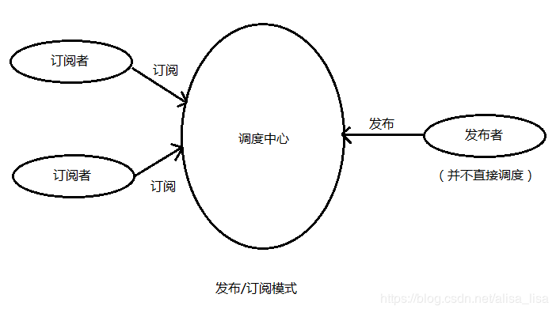

## 订阅-发布模式

- 订阅-发布模式定义了一种一对多的关系，让多个观察者同时监听某一个主题对象，这个主题对象的状态发生改变时就会通知所有观察者对象。

- 订阅-发布模式，基于一个主题/事件通道，希望接收通知的对象（称为 subscriber）通过自定义事件订阅主题，被激活事件的对象（称为 publisher）通过发布主题事件的方式被通知

- 就和用户订阅微信公众号一个道理，一个公众号可以被多个用户同时订阅，当公众号有新增内容的时候，只要发布就好了，用户就能接收到最新的内容

- 发布-订阅模式的作用：主要是为了处理一对多的场景，应用于不同情况下的不同函数的调用

  - 优点：耦合性低，便于代码的维护
  - 缺点：创建订阅者本身要消耗一定的时间和内存，可以订阅的消息未发生，但这个订阅者会始终存在于内存中

- js 中的事件监听机制就是一种观察者模式

- 发布者发出通知->主题对象收到通知并推送给订阅者->订阅者执行相应操作

