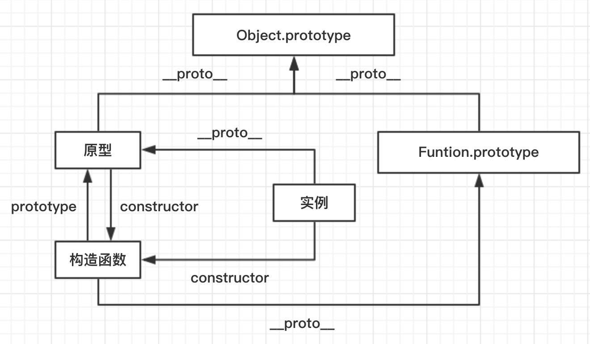

## prptotype

- 构造函数，原型，实例的关系：
  - 每个构造函数（constructor）都有一个原型对象（prototype）;
  - 原型对象（prototype）中都包含一个指向构造函数（constructor）的指针;
  - 而实例（instance）都包含一个指向原型对象（prototype）的内部指针；

- 如果试图引用对象(实例instance)的某个属性,会首先在对象内部寻找该属性,直至找不到,然后才在该对象的原型(instance.prototype)里去找这个属性.

- 原型,构造函数,实例三者之间的关系：
  - 实例.__proto__ === 原型
  - 原型.constructor === 构造函数
  - 构造函数.prototype === 原型
;
```
/* 题目 1 */
var A = function(){}
A.prototype.n = 1;
var b = new A();
A.prototype = {
  n:2,
  m:3
}
var c = new A();
console.log(b.n);//1
console.log(b.m);//undefined
console.log(c.n);//2
console.log(c.m);//3

console.log("-----------------------");
/* 题目 2 */
var F = function(){}
Object.prototype.a = function(){
  console.log('a');
}
Function.prototype.b = function(){
  console.log("b");
}
var f = new F();
f.a(); //a
//f.b(); // f.b is not a function

F.a(); //a
F.b(); //b

console.log("-----------------");
/* 题目 3 */
function Person(name){
  this.name = name;
}
let p = new Person("tom");
console.log(p.__proto__); //Person {} (Person.prototype)
console.log(Person.__proto__); //{ [Function] b: [Function] (Function.prototype)

console.log("-----------------");
/* 题目 4 */
var foo = {},F = function(){};
Object.prototype.a = "value a";
Function.prototype.b = "value b";
console.log(foo.a); //value a
console.log(foo.b); //undefined
console.log(F.a); //value a
console.log(F.b); //value b

```

### 判断原型和实例的继承关系

- 使用原型链后，判断原型和实例之间的继承关系，方法一般有两种：
  - instanceof 操作符，只要用这个操作符来测试实例（instance）与原型链中出现过的构造函数，结果就是true
  ```
  alert(instance instanceof Object);//true
  alert(instance instanceof Father);//true
  alert(instance instanceof Son);//true
  ```
  - isPrototypeOf() 方法，同样只要是在原型链中出现过的原型，isPrototypeOf()方法就会返回true
  ```
  alert(Object.prototype.isPrototypeOf(instance));//true
  alert(Father.prototype.isPrototypeOf(instance));//true
  alert(Son.prototype.isPrototypeOf(instance));//true
  ```

### 原型链的问题
- 当原型链中包含引用类型值的原型时，该引用类型会被所有实例继承
- 在创建子类时（例如创建Son实例）时，不能向超类型（例如Father）的构造函数中传递参数
- 有鉴于此，实践中很少会单独使用原型链

### 借用构造函数（construceor stealing）也叫经典继承

- 借用构造函数的基本思想：即在子类的构造函数内部调用超类的构造函数
- 借用构造函数可以解决原型链的两大问题：
  - 1、保证了原型链中引用类型值的独立，不再被共享
  - 2、子类型创建时能向父类型传递参数
- 仅仅使用借用构造函数，那么将无法避免构造函数模式存在的问题：
  - 方法都在构造函数中定义，因此函数的复用也就不可用了
  - 而且超类型中定义的方法，对子类型而言也是不可见的
- 基于以上的问题，借用构造函数的方式也很少单独使用
```
// 超类构造函数 
function Father(){
  this.color = ["red","blue","green"];
}
// 子类构造函数
function Son(){
  //在子类的构造函数中调用超类的构造函数
  Father.call(this);
}

var instance1 = new Son();
instance1.color.push("yellow");
console.log(instance1.color);

var instance2 = new Son();
console.log(instance2.color);
```

### 组合继承（原型链+借用构造函数）

- 组合继承，有时也叫伪经典继承，指的是**将原型和借用构造函数的技术组合到一块**，从而发挥两者之长的一种继承模式。
- 组合继承的基本思路： 使用原型链实现对原型属性和方法的继承，通过借用构造函数来实现对实例属性的继承
- 这样，既通过在原型上定义方法实现了函数复用，又能保证每个实例都有自己的属性
- 组合继承避免了原型链和借用构造函数的缺点，融合了它们的优点，成为javascript中最常用的继承模式，而且instanceof和isPrototypeOf()也能用于识别基于组合继承创建的对象
- 组合继承其实调用了两次父类构造函数，造成了不必要的消耗
```
function Father(name){
  this.name = name;
  this.color = ["red","green","blue"];
}
Father.prototype.sayName = function(){
  console.log(this.name);
}

function Son(name,age){
  Father.call(this,name); //继承实例属性，第一次调用Father()
  this.age = age;
}

Son.prototype = new Father(); //继承父类的方法，第二次调用Father
Son.prototype.sayAge = function(){
  console.log(this.age);
}

var instance1 = new Son("locis",5);
instance1.color.push("black");
console.log(instance1.color);
instance1.sayName();
instance1.sayAge();

var instance2 = new Son("aa",10);
console.log(instance2.color);
instance2.sayName();
instance2.sayAge();
```