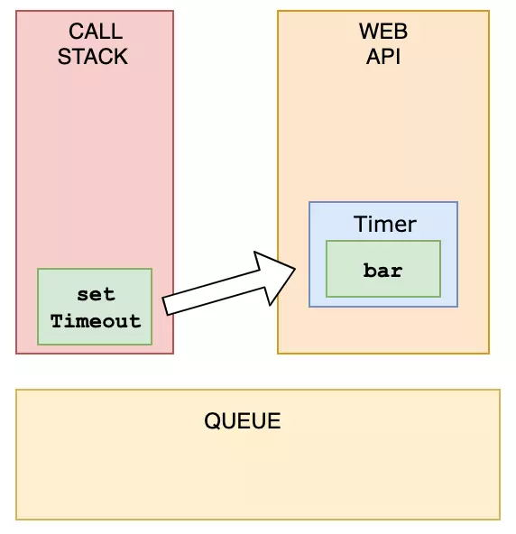
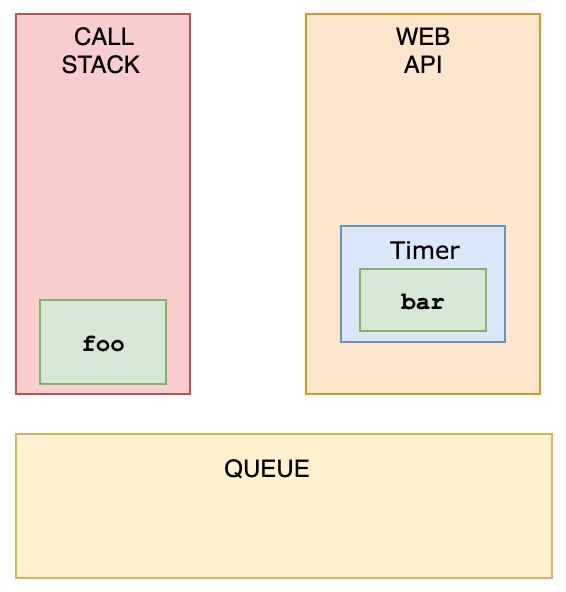
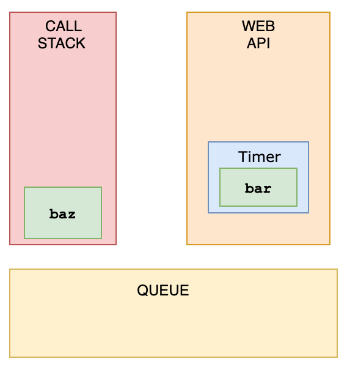
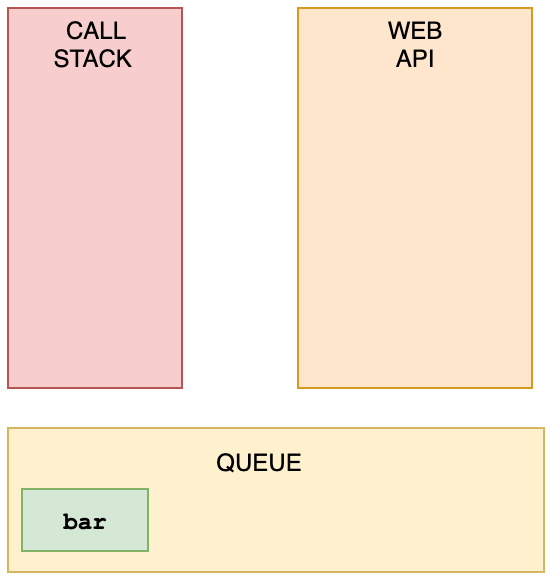
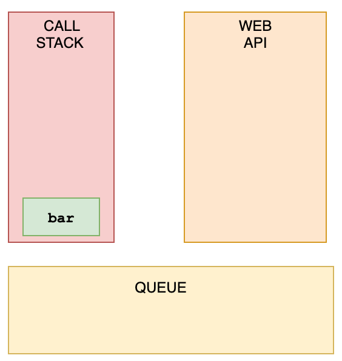

## 下面代码的输出是什么?

```
const foo = () => console.log("First");
const bar = () => setTimeout(() => console.log("Second"));
const baz = () => console.log("Third");

bar();
foo();
baz();
//First Third Second
```

- 在浏览器中不只有运行引擎，还有一个叫做 WebAPI 的东西，WebAPI 为我们提供了 setTimeout...等函数

- 上面代码执行过程：
  - 将 callback 推送到 WebAPI 后，setTimeout 函数本身（但不是回调）从堆栈中弹出
    
  - 调用 foo,并打印 First
    
  - foo 从堆栈中弹出，baz 被调用，并打印 Third
    
  - WebAPI 不能只是在准备就绪时将内容添加到堆栈中。相反，它会将回调函数推送到一个称为**任务队列**的东西
    
  - 这是事件循环开始工作的地方。事件循环查看堆栈和任务队列。如果堆栈为空，则会占用队列中的第一个内容并将其推送到堆栈中
    
  - bar 被调用，Second 被打印，它从栈中弹出
